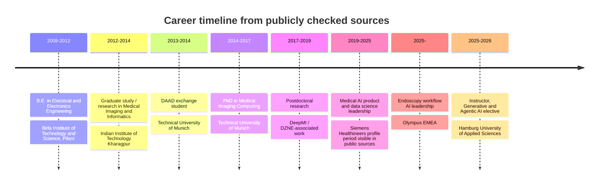
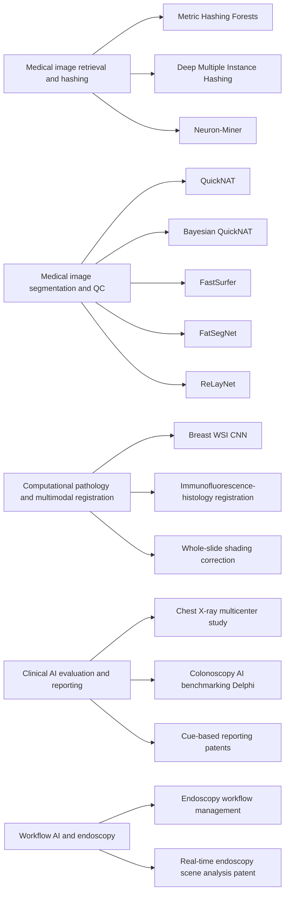

# GitHub Pages Research Dossier for Sailesh Conjeti

## Executive Summary

The current public GitHub Pages site for Sailesh Conjeti is still largely placeholder content, with a generic homepage label, incomplete portfolio items, and no substantive academic or professional narrative yet visible. That means the site can be substantially strengthened by replacing template copy with a research-forward profile, a curated publication record, a patents page, and a concise but credible professional biography grounded in public sources. citeturn2view0turn28search0turn9view5

Across the sources I checked, the highest-confidence profile is this: Sailesh Conjeti is a medical AI researcher and digital-health product leader with academic roots in medical image computing. The most recent public evidence I found places him at entity["company","Olympus Corporation","medical technology company"] in an endoscopy workflow leadership role; he is also publicly listed by entity["organization","Hamburg University of Applied Sciences","Hamburg, Germany"] as staff/instructor and is named as the instructor of a 2025–2026 elective project on generative and agentic AI. Older but still valuable public profile metadata also shows prior leadership roles at entity["company","Siemens Healthineers","medical technology company"]. citeturn33search0turn29search4turn32search3turn32search4turn32search5turn29search1turn16search3

Academically, the strongest verified foundation is a PhD completed summa cum laude at entity["organization","Technical University of Munich","Munich, Germany"], followed by postdoctoral work associated with the entity["organization","German Center for Neurodegenerative Diseases","Bonn, Germany"] / DeepMI ecosystem. Earlier education and research affiliations publicly visible include entity["organization","Indian Institute of Technology Kharagpur","Kharagpur, India"] and entity["organization","Birla Institute of Technology and Science, Pilani","Pilani, India"]. His publication profile spans medical image retrieval, neuroimaging, OCT and IVUS analysis, computational pathology, uncertainty-aware segmentation, radiology workflow AI, and more recently endoscopy and clinical-AI evaluation. citeturn29search1turn17view0turn10search7turn16search3turn33search0

The public scholarly record is broad. ResearchGate exposes 87 raw publication records and 4,260 citations on the checked profile; Google Scholar search results confirm a scholar profile with a verified olympus.com email. Because those raw profile counts include duplicates such as preprint/final pairs and chapter/article variants, the publication inventory below is a deduplicated, best-effort verified list based on primary or near-primary public records such as PubMed, TUM’s research portal, DBLP, proceedings records, and public profile pages. citeturn17view0turn16search3turn14view0

Public patent records are also strong. I verified multiple patent families in radiology reporting assistance, metadata generation, medical-image evaluation, multi-input 2D image analysis, and real-time endoscopy workflow support. Public code under the verified entity["company","GitHub","software hosting company"] account includes teaching-oriented repositories on Ollama, local agentic AI workflows, and the current site source. Public grant listings and a clearly attributable public dataset portfolio were not identifiable in the checked English-language sources, so those should be marked as **unspecified** unless you add them manually. citeturn22search0turn20search3turn20search5turn20search2turn18search1turn18search0turn8view0turn9view0turn9view5

## Verified Profile and Career Snapshot

The most defensible public profile for website use is that Sailesh Conjeti works at the intersection of medical AI research, regulated clinical product development, and AI-enabled healthcare workflows. The recent Olympus interview describes him as Stream Lead, Endoscopy Workflow Management (Director) at Olympus EMEA; HAW Hamburg publicly lists him as a faculty staff member and course instructor; LinkedIn public search results add a public-facing summary centered on scalable, regulated digital-health products and also preserve core education and awards metadata. citeturn33search0turn29search4turn32search3turn29search1

The academic backbone is consistent across profiles. Publicly visible profile data shows a PhD in medical imaging computing at TUM completed in 2017 with summa cum laude distinction, preceded by study or research experience at IIT Kharagpur and BITS Pilani. DeepMI’s alumni page records postdoctoral work from 2017 to 2019 and lists a later move into industry; ResearchGate places his historical research in medical imaging, pattern recognition, biomedical imaging, machine learning, and related domains. citeturn29search1turn17view0turn10search7

Publicly visible research themes and outputs concentrate in five clusters: large-scale content-based medical image retrieval and hashing; segmentation and quality control for neuroimaging; imaging methods for OCT, IVUS, and pathology; clinical validation and benchmarking of AI systems; and recent workflow-oriented AI in radiology and endoscopy. Those themes are reinforced by the papers, patents, current teaching topic, and recent interview language about workflow AI and clinical deployment. citeturn34search2turn33search11turn13search5turn33search5turn33search0turn32search3

The public awards record is strongest for the MICCAI/Medical Image Analysis ecosystem and selected industry recognition. Checked public profile text supports a 2016 Medical Image Analysis Best Paper Award for “Metric hashing forests,” runner-up Young Scientist recognition at MICCAI 2017, and 2021 industry recognitions at Siemens Healthineers including “Successful Digital Health Inventor in 2021” and “Finalist, Most Innovative Project Award.” The MICCAI 2015 runner-up mention appears on LinkedIn but I did not separately verify it from an independent award page during this run, so I treat it as profile-level evidence rather than independently confirmed archival evidence. citeturn32search0turn29search1turn34search2





## Publications Corpus

What follows is a **deduplicated, best-effort verified publication inventory** for English-language public sources. I collapsed obvious duplicates where a final article and a preprint/versioned abstract both existed, and I retained standalone preprints only when they remain independently useful or where I could not fully confirm a later canonical venue during this run. The grouping table is therefore a **minimum verified corpus**, not a claim that no additional records exist beyond these checked sources. citeturn17view0turn14view0turn29search1

| Year range | Dominant record types | Notes |
|---|---|---|
| 2024–2021 | Clinical AI evaluation and validation articles | Colonoscopy AI benchmarking; multicenter chest X-ray AI study. |
| 2020–2019 | Neuroimaging and adipose MRI articles plus workshop abstracts | FastSurfer, FatSegNet, QuickNAT-related work. |
| 2018–2017 | MICCAI/ECCV/ISBI chapters, workshop papers, and pivotal journal papers | Adversarial benchmarking, QC, motion analysis, ReLayNet, retrieval work. |
| 2016–2015 | Core retrieval, IVUS, registration, and pathology work | Metric hashing, domain adaptation, Neuron-Miner, registration methods. |
| 2014–2011 | Early biomedical signal processing, ophthalmic, oral pathology, and iris-recognition records | Mostly visible through ResearchGate, LinkedIn, DBLP, and proceedings/profile pages. |

The following table highlights the highest-confidence records to feature on the site.

| Year | Type | Publication | Venue / DOI or source | Short summary | Citation count if available | Evidence |
|---|---|---|---|---|---|---|
| 2024 | Article | **Creating a standardized tool for the evaluation and comparison of artificial intelligence-based computer-aided detection programs in colonoscopy: a modified Delphi approach**. Authors include Sanjay R. V. Gadi, Yuichi Mori, Masashi Misawa, …, **Sailesh Conjeti**, …, Jeremy R. Glissen Brown. | PubMed record / source link | Consensus-driven framework for comparing AI-based CADe tools in colonoscopy. | Unspecified in checked source | PubMed citeturn33search5 |
| 2021 | Article | **An Artificial Intelligence–Based Chest X-ray Model on Human Nodule Detection Accuracy From a Multicenter Study**. Authors include Fatemeh Homayounieh, Subba Digumarthy, Shadi Ebrahimian, …, **Sailesh Conjeti**, …, Mannudeep Kalra. | Public profile record / source link | Multicenter study on whether AI assistance improves pulmonary nodule detection on chest radiographs. | Unspecified in checked source | ResearchGate citeturn17view0 |
| 2020 | Article | Leonie Henschel, **Sailesh Conjeti**, Santiago Estrada, Kersten Diers, Bruce Fischl, Martin Reuter. **FastSurfer – A fast and accurate deep learning based neuroimaging pipeline**. | *NeuroImage* 219 (2020), DOI 10.1016/j.neuroimage.2020.117012 | A fast deep-learning alternative to traditional structural MRI processing pipelines. | 782 in checked source | ScienceDirect / profile records citeturn16search11turn17view0 |
| 2020 | Article | Kausik Das, **Sailesh Conjeti**, Jyotirmoy Chatterjee, Debdoot Sheet. **Detection of Breast Cancer From Whole Slide Histopathological Images Using Deep Multiple Instance CNN**. | *IEEE Access* 8 (2020), DOI 10.1109/ACCESS.2020.3040106 | Deep multiple-instance learning for very large whole-slide histopathology images. | Unspecified in checked source | ResearchGate citeturn34search12 |
| 2020 | Chapter / abstract | Santiago Estrada, Ran Lu, **Sailesh Conjeti**, …, Martin Reuter. **Abstract: Fully Automated Deep Learning Pipeline for Adipose Tissue Segmentation on Abdominal Dixon MRI**. | Workshop/chapter source record | Abstract version of the FatSegNet work for public-facing proceedings visibility. | Unspecified | ResearchGate citeturn30view0 |
| 2020 | Chapter / abstract | Leonie Henschel, **Sailesh Conjeti**, Santiago Estrada, …, Martin Reuter. **Abstract: FastSurfer: A Fast and Accurate Deep Learning Based Neuroimaging Pipeline**. | Workshop/chapter source record | Proceeding-style abstract of the FastSurfer pipeline. | Unspecified | ResearchGate citeturn30view1 |
| 2019 | Article | Santiago Estrada, Ran Lu, **Sailesh Conjeti**, Martin Reuter. **FatSegNet: A Fully Automated Deep Learning Pipeline for Adipose Tissue Segmentation on Abdominal Dixon MRI**. | *Magnetic Resonance in Medicine* 83(4), DOI 10.1002/mrm.28022 | Automated VAT/SAT segmentation and quantification from abdominal Dixon MRI. | 108 in checked source | PMC / profile records citeturn34search13turn30view2 |
| 2019 | Article | Abhijit Guha Roy, **Sailesh Conjeti**, Nassir Navab, Christian Wachinger. **QuickNAT: A fully convolutional network for quick and accurate segmentation of neuroanatomy**. | *NeuroImage* 186 (2019), DOI 10.1016/j.neuroimage.2018.11.042 | Fast, accurate whole-brain segmentation from MRI. | Unspecified in checked source | Duke Scholars / profile records citeturn34search0turn17view0 |
| 2019 | Article | Abhijit Guha Roy, **Sailesh Conjeti**, Nassir Navab, Christian Wachinger. **Bayesian QuickNAT: Model uncertainty in deep whole-brain segmentation for structure-wise quality control**. | Public profile / source link | Extends QuickNAT with uncertainty-aware quality control. | Unspecified in checked source | ResearchGate citeturn30view3 |
| 2019 | Chapter | Magdalini Paschali, **Sailesh Conjeti**, Fernando Navarro, Nassir Navab. **Adversarial Examples as Benchmark for Medical Imaging Neural Networks**. | *Bildverarbeitung für die Medizin 2019*, DOI 10.1007/978-3-658-25326-4_4 | Compact benchmark-oriented version of the robustness work. | Unspecified | TUM portal citeturn29search9turn33search10 |
| 2019 | Conference paper | Jian Kang, Gihan Samarasinghe, Upul Senanayake, **Sailesh Conjeti**, Arcot Sowmya. **Deep Learning for Volumetric Segmentation in Spatio-Temporal Data: Application to Segmentation of Prostate in DCE-MRI**. | ISBI 2019 / DBLP source link | Applies deep learning to volumetric segmentation in spatio-temporal DCE-MRI. | Unspecified | DBLP / profile records citeturn14view0turn30view3 |
| 2018 | Conference chapter | Huseyin Coskun, David Joseph Tan, **Sailesh Conjeti**, Nassir Navab, Federico Tombari. **Human Motion Analysis with Deep Metric Learning**. | ECCV 2018 / source link | Metric-learning formulation for human motion representation and analysis. | 16 Scopus citations | TUM portal / DBLP citeturn13search10turn14view0 |
| 2018 | Conference chapter | Abhijit Guha Roy, **Sailesh Conjeti**, Nassir Navab, Christian Wachinger. **Inherent Brain Segmentation Quality Control from Fully ConvNet Monte Carlo Sampling**. | MICCAI 2018 / source link | Uses Monte Carlo sampling for uncertainty-based segmentation QC. | 59 Scopus citations | TUM portal citeturn26search6 |
| 2018 | Conference chapter | Fernando Navarro, **Sailesh Conjeti**, Federico Tombari, Nassir Navab. **Webly Supervised Learning for Skin Lesion Classification**. | MICCAI-associated chapter / source link | Uses noisy large-scale web data to improve lesion classification. | Unspecified | ResearchGate / DBLP citeturn30view4turn14view0 |
| 2018 | Conference chapter | Magdalini Paschali, **Sailesh Conjeti**, Fernando Navarro, Nassir Navab. **Generalizability vs. robustness: Investigating medical imaging networks using adversarial examples**. | MICCAI 2018 / source link | A robustness evaluation framework for medical imaging models using adversarial examples. | 107 Scopus citations | TUM portal citeturn26search9 |
| 2018 | Article / chapter-style record | Amin Katouzian, Hongzhi Wang, **Sailesh Conjeti**, …, Nassir Navab. **Hashing-Based Atlas Ranking and Selection for Multiple-Atlas Segmentation**. | Public profile / source link | Registration-free atlas ranking via learned hash codes and learned distance metrics. | Unspecified | ResearchGate citeturn30view5 |
| 2018 | Conference chapter | Shubham Kumar, Abhijit Guha Roy, Ping Wu, **Sailesh Conjeti**, …, Kuangyu Shi. **Learning Optimal Deep Projection of ^18F-FDG PET Imaging for Early Differential Diagnosis of Parkinsonian Syndromes**. | DLMIA/ML-CDS 2018 / source link | Uses deep PET projection features for early differential diagnosis of parkinsonian syndromes. | Unspecified | TUM portal citeturn29search5 |
| 2018 | Conference chapter | **Sailesh Conjeti**, Magdalini Paschali, Abhijit Guha Roy, Nassir Navab. **Abstract: Deep Hashing for Large-Scale Medical Image Retrieval**. | *Bildverarbeitung für die Medizin 2018*, DOI 10.1007/978-3-662-56537-7_21 | Short abstract version of the large-scale medical retrieval work. | 1 Scopus citation in checked source | TUM portal citeturn33search9 |
| 2017 | Journal article | Abhijit Guha Roy, **Sailesh Conjeti**, Sri Phani Krishna Karri, Debdoot Sheet, Amin Katouzian, Christian Wachinger, Nassir Navab. **ReLayNet: retinal layer and fluid segmentation of macular optical coherence tomography using fully convolutional networks**. | *Biomedical Optics Express* 8(8), DOI 10.1364/BOE.8.003627 | Highly cited OCT segmentation paper for retinal layers and fluid. | 725 cited by in checked source | PubMed / TUM portal citeturn13search9turn13search5 |
| 2017 | Conference chapter | **Sailesh Conjeti**, Magdalini Paschali, Amin Katouzian, Nassir Navab. **Deep multiple instance hashing for scalable medical image retrieval**. | MICCAI 2017 / source link | Weakly supervised multiple-instance deep hashing for scalable retrieval. | 22 Scopus citations | TUM portal / DBLP citeturn26search4turn34search4 |
| 2017 | Conference chapter | Anees Kazi, **Sailesh Conjeti**, Amin Katouzian, Nassir Navab. **Coupled Manifold Learning for Retrieval Across Modalities**. | ICCV Workshops 2017 / source link | Cross-modal manifold alignment for similarity-preserving retrieval. | 1 Scopus citation | TUM portal / DBLP citeturn33search7turn23view0 |
| 2016 | Journal article | **Sailesh Conjeti**, Amin Katouzian, Anees Kazi, Sepideh Mesbah, David Beymer, Tanveer F. Syeda-Mahmood, Nassir Navab. **Metric hashing forests**. | *Medical Image Analysis* 34, DOI 10.1016/j.media.2016.05.010 | Supervised random-forest hashing for nearest-neighbor image retrieval. | 21 Scopus citations | TUM portal citeturn34search2 |
| 2016 | Journal article | **Sailesh Conjeti**, Amin Katouzian, Abhijit Guha Roy, Loïc Peter, Debdoot Sheet, Stéphane Carlier, Andrew Laine, Nassir Navab. **Supervised domain adaptation of decision forests: Transfer of models trained in vitro for in vivo intravascular ultrasound tissue characterization**. | *Medical Image Analysis* 32, DOI 10.1016/j.media.2016.02.005 | Domain adaptation for IVUS tissue characterization under source/target shift. | 30 cited by in checked source | PubMed citeturn33search3 |
| 2016 | Journal article | **Sailesh Conjeti**, Sepideh Mesbah, Mohammadreza Negahdar, Philipp L. Rautenberg, Shaoting Zhang, Nassir Navab, Amin Katouzian. **Neuron-Miner: An Advanced Tool for Morphological Search and Retrieval in Neuroscientific Image Databases**. | *Neuroinformatics* 14(4), DOI 10.1007/s12021-016-9300-2 | Retrieval system for neuron morphology databases. | 19 cited by in checked source | PubMed citeturn33search11 |
| 2015 | Conference chapter | Sepideh Mesbah, **Sailesh Conjeti**, Ajayrama Kumaraswamy, Philipp Rautenberg, Nassir Navab, Amin Katouzian. **Hashing Forests for Morphological Search and Retrieval in Neuroscientific Image Databases**. | MICCAI 2015 / source link | Earlier conference-stage work leading toward retrieval tools such as Neuron-Miner. | Unspecified | Springer / profile records citeturn26search11turn31view0 |
| 2015 | Conference paper | Shadi Albarqouni, Maximilian Baust, **Sailesh Conjeti**, Ashraf Al-Amoudi, Nassir Navab. **Multi-scale Graph-based Guided Filter for De-noising Cryo-Electron Tomographic Data**. | BMVC 2015, DOI 10.5244/C.29.17 | Graph-based denoising for low-SNR cryo-electron tomography. | 1 Scopus citation | TUM portal / BMVC portal citeturn13search0turn29search3 |
| 2015 | Conference chapter | **Sailesh Conjeti**, Mehmet Yigitsoy, Debdoot Sheet, Jyotirmoy Chatterjee, Nassir Navab, Amin Katouzian. **Mutually coherent structural representation for image registration through joint manifold embedding and alignment**. | ISBI 2015, DOI 10.1109/ISBI.2015.7163945 | Cross-modal image registration via manifold embedding and joint alignment. | 1 Scopus citation | TUM portal citeturn26search1turn26search7 |
| 2015 | Conference chapter | **Sailesh Conjeti**, Mehmet Yigitsoy, Tingying Peng, Debdoot Sheet, Jyotirmoy Chatterjee, Christine Bayer, Nassir Navab, Amin Katouzian. **Deformable registration of immunofluorescence and histology using iterative cross-modal propagation**. | ISBI 2015, DOI 10.1109/ISBI.2015.7163875 | Iterative modality propagation for deformable multimodal tissue registration. | Unspecified | TUM portal citeturn26search2turn34search11 |

Additional verified records visible in the checked sources include **Adversarial Examples as Benchmark for Medical Imaging Neural Networks**; **Hashing-Based Atlas Ranking and Selection for Multiple-Atlas Segmentation**; **Learning Optimal Deep Projection of ^18F-FDG PET Imaging for Early Differential Diagnosis of Parkinsonian Syndromes**; **Complex Fully Convolutional Neural Networks for MR Image Reconstruction**; **InfiNet: Fully Convolutional Networks for Infant Brain MRI Segmentation**; **Multiple instance learning of deep convolutional neural networks for breast histopathology whole slide classification**; **Learning Robust Hash Codes for Multiple Instance Image Retrieval**; **Error Corrective Boosting for Learning Fully Convolutional Networks with Limited Data**; **Exploring feature extraction as an alternative to feature selection**; **Heterogeneous ensembles for predicting survival of metastatic, castrate-resistant prostate cancer patients**; **Multiscale distribution preserving autoencoders for plaque detection in intravascular optical coherence tomography**; **Deeply learnt hashing forests for content based image retrieval in prostate MR images**; **Lumen Segmentation in Intravascular Optical Coherence Tomography Using Backscattering Tracked and Initialized Random Walks**; **Full-wave intravascular ultrasound simulation from histology**; and earlier public-profile records on driver stress monitoring, retinal-vessel detection, oral-pathology quantification, electromyography-based diagnosis, and iris recognition. These appear in DBLP, TUM, PubMed, ResearchGate, and LinkedIn profile pages, but not every one was accessible enough during this run to extract a fully canonical DOI-authors-venue-summary tuple without ambiguity. citeturn30view3turn30view4turn30view5turn30view6turn30view7turn31view0turn31view1turn31view2turn31view4turn31view5turn31view6turn23view4turn24view0turn29search6turn13search13

The public profiles also reveal clear author-name variants that should be normalized on the site as **Sailesh Conjeti** and **Conjeti, S.** when importing citations. Where a final journal/conference version was known, I recommend suppressing duplicate arXiv/CoRR entries on the website and retaining the preprint only when it adds substantive value or no final version is easily verifiable. citeturn14view0turn17view0

**BibTeX starter file content**  
Save the following as `sailesh-conjeti-publications.bib`. This is a high-value starter set rather than a complete canonical export; for the final all-publications `.bib`, the best route is to export the Google Scholar profile and then hand-deduplicate against DBLP and the TUM portal.

```bibtex
@article{fastsurfer2020,
  author  = {Henschel, Leonie and Conjeti, Sailesh and Estrada, Santiago and Diers, Kersten and Fischl, Bruce and Reuter, Martin},
  title   = {FastSurfer - A fast and accurate deep learning based neuroimaging pipeline},
  journal = {NeuroImage},
  volume  = {219},
  pages   = {117012},
  year    = {2020},
  doi     = {10.1016/j.neuroimage.2020.117012}
}

@article{fatsegnet2019,
  author  = {Estrada, Santiago and Lu, Ran and Conjeti, Sailesh and Reuter, Martin},
  title   = {FatSegNet: A Fully Automated Deep Learning Pipeline for Adipose Tissue Segmentation on Abdominal Dixon MRI},
  journal = {Magnetic Resonance in Medicine},
  volume  = {83},
  number  = {4},
  pages   = {1471--1483},
  year    = {2019},
  doi     = {10.1002/mrm.28022}
}

@article{quicknat2019,
  author  = {Guha Roy, Abhijit and Conjeti, Sailesh and Navab, Nassir and Wachinger, Christian},
  title   = {QuickNAT: A fully convolutional network for quick and accurate segmentation of neuroanatomy},
  journal = {NeuroImage},
  volume  = {186},
  pages   = {713--727},
  year    = {2019},
  doi     = {10.1016/j.neuroimage.2018.11.042}
}

@article{relaynet2017,
  author  = {Guha Roy, Abhijit and Conjeti, Sailesh and Karri, Sri Phani Krishna and Sheet, Debdoot and Katouzian, Amin and Wachinger, Christian and Navab, Nassir},
  title   = {ReLayNet: retinal layer and fluid segmentation of macular optical coherence tomography using fully convolutional networks},
  journal = {Biomedical Optics Express},
  volume  = {8},
  number  = {8},
  pages   = {3627--3642},
  year    = {2017},
  doi     = {10.1364/BOE.8.003627}
}

@inproceedings{deepmihash2017,
  author    = {Conjeti, Sailesh and Paschali, Magdalini and Katouzian, Amin and Navab, Nassir},
  title     = {Deep multiple instance hashing for scalable medical image retrieval},
  booktitle = {Medical Image Computing and Computer-Assisted Intervention},
  pages     = {550--558},
  year      = {2017}
}

@article{metrichashing2016,
  author  = {Conjeti, Sailesh and Katouzian, Amin and Kazi, Anees and Mesbah, Sepideh and Beymer, David and Syeda-Mahmood, Tanveer F. and Navab, Nassir},
  title   = {Metric hashing forests},
  journal = {Medical Image Analysis},
  volume  = {34},
  pages   = {13--29},
  year    = {2016},
  doi     = {10.1016/j.media.2016.05.010}
}

@article{domainadaptation2016,
  author  = {Conjeti, Sailesh and Katouzian, Amin and Guha Roy, Abhijit and Peter, Loic and Sheet, Debdoot and Carlier, Stephane and Laine, Andrew and Navab, Nassir},
  title   = {Supervised domain adaptation of decision forests: Transfer of models trained in vitro for in vivo intravascular ultrasound tissue characterization},
  journal = {Medical Image Analysis},
  volume  = {32},
  pages   = {1--17},
  year    = {2016},
  doi     = {10.1016/j.media.2016.02.005}
}

@article{neuronminer2016,
  author  = {Conjeti, Sailesh and Mesbah, Sepideh and Negahdar, Mohammadreza and Rautenberg, Philipp L. and Zhang, Shaoting and Navab, Nassir and Katouzian, Amin},
  title   = {Neuron-Miner: An Advanced Tool for Morphological Search and Retrieval in Neuroscientific Image Databases},
  journal = {Neuroinformatics},
  volume  = {14},
  number  = {4},
  pages   = {369--385},
  year    = {2016},
  doi     = {10.1007/s12021-016-9300-2}
}

@inproceedings{mcsr2015,
  author    = {Conjeti, Sailesh and Yigitsoy, Mehmet and Sheet, Debdoot and Chatterjee, Jyotirmoy and Navab, Nassir and Katouzian, Amin},
  title     = {Mutually coherent structural representation for image registration through joint manifold embedding and alignment},
  booktitle = {2015 IEEE 12th International Symposium on Biomedical Imaging},
  pages     = {601--604},
  year      = {2015},
  doi       = {10.1109/ISBI.2015.7163945}
}

@inproceedings{crossmodalprop2015,
  author    = {Conjeti, Sailesh and Yigitsoy, Mehmet and Peng, Tingying and Sheet, Debdoot and Chatterjee, Jyotirmoy and Bayer, Christine and Navab, Nassir and Katouzian, Amin},
  title     = {Deformable registration of immunofluorescence and histology using iterative cross-modal propagation},
  booktitle = {2015 IEEE 12th International Symposium on Biomedical Imaging},
  pages     = {310--313},
  year      = {2015},
  doi       = {10.1109/ISBI.2015.7163875}
}
```

## Patents and Public Code

The patent record is strong enough to justify a full patents page. I recommend organizing patents by **family**, not by every jurisdictional variant, because the public records already show linked US/EP/DE/PCT counterparts. citeturn22search0turn20search3turn20search5turn20search2turn18search1turn18search0

| Family title | Inventors | Assignee | Representative numbers and dates | What it covers | Evidence |
|---|---|---|---|---|---|
| **Method for providing at least one metadata attribute associated with medical image data** | **Sailesh Conjeti**, Alexis Laugerette, Christian Hümmer | Siemens Healthineers AG | US12322091B2 / US17/671,950; priority 2021-03-01; granted 2025-06-03. DE102021201912A1 is a checked counterpart. | Infers or provides metadata attributes linked to medical image data. | Google Patents citeturn20search3turn20search1 |
| **Method and apparatus for the evaluation of medical image data** | Christian Hümmer, **Sailesh Conjeti**, Alexander Preuhs, Lei Wang | Siemens Healthineers AG | US20220398729A1 / US17/838,842; priority 2021-06-15; granted as US12450733B2 in 2025. DE102021206108A1 checked counterpart. | Evaluation/classification workflow for medical image data. | Google Patents citeturn20search5turn20search0 |
| **Cue-based medical reporting assistance** | **Sailesh Conjeti** | Siemens Healthineers AG | EP4141878A1 / EP21193589.5A; priority 2021-08-27; publication 2023-03-01. US20230076903A1 appears as the checked family counterpart. | Uses diagnostic cues in a reporting workflow to improve completeness and correctness of medical reports. | Google Patents citeturn22search0 |
| **Automatic analysis of 2D medical image data with an additional object** | Christian Hümmer, Sven-Martin Sutter, **Sailesh Conjeti** | Siemens Healthineers AG | US12444047B2 / US17/950,465; priority 2021-09-24; US grant 2025-10-14. EP4156090B1/C0 family checked with grant 2025-07-16. | Combines medical image data with additional external image data to identify external objects and adapt analysis. | Google Patents citeturn20search2turn20search4 |
| **Method for generating protocol data of a radiological image / report workflow** | **Sailesh Conjeti** | Siemens Healthineers AG | US20230282337A1 / US18/175,799; pending in checked record. | Bridges user-generated radiology content and AI-generated structured objects for peer review / protocol generation. | Google Patents citeturn18search1turn21search0 |
| **Real-time endoscopy scene analysis and photo-documentation** | **Sailesh Conjeti** | entity["company","Gyrus ACMI Inc","Westborough, MA, US"] | WO2025259475A1 / PCT/US2025/032101; priority 2024-06-14; filed 2025-06-03; published 2025-12-18. | Real-time endoscopy scene analysis, area-of-interest recognition, and guided photo-documentation. | Google Patents citeturn18search0turn19search4 |

Two additional Olympus/Gyrus endoscopy-themed patent families surfaced in a secondary IP database, but because I did not re-verify those specific family pages in Google Patents during this run, I excluded them from the main verified table and would treat them as **pending confirmation** before publishing. citeturn33search2

For public code, I could directly verify the following repositories under the public GitHub account. I also saw that the repositories page itself loaded incompletely in the checked session, so the table below includes only repos I opened directly and therefore consider high confidence. Metrics are point-in-time and may change. citeturn7view0turn8view0turn8view1turn8view2

| Repository | Tech stack | Description | Metrics at check time | Evidence |
|---|---|---|---|---|
| `saileshconjeti/Ollama-Tutorials` | Python, Ollama, Open WebUI | Classroom labs for local LLMs, structured output, embeddings, tiny RAG, tool calling, and a personalized course TA. | 1 star, 0 forks | GitHub repo page citeturn8view0 |
| `saileshconjeti/ollama_agentic_ai_tutorials` | Python, Ollama, LangChain, LangGraph, Streamlit | Step-by-step local tutorials for agentic AI and teaching workflows. | 0 stars, 0 forks | GitHub repo page citeturn9view0 |
| `saileshconjeti/saileshconjeti.github.io` | Astro, JavaScript, HTML, SCSS | Current GitHub Pages source for the personal website. | 0 stars, 0 forks | GitHub repo page citeturn9view5 |

A dedicated public dataset portfolio attributable directly to Sailesh Conjeti was **not identifiable** in the checked English-language sources. For the site, I would therefore rename any “Datasets” menu item to **Software & Resources** unless you plan to add a curated list manually. citeturn17view0turn29search1turn9view5

## Website-Ready Copy

The following snippets are written to be credible against the checked public record while staying professional, concise, and appropriate for an academic-industry hybrid profile. They are designed for direct use in markdown or simple HTML sections on the site. The content is grounded in the publicly checked profile, publication, patent, teaching, and repository sources above. citeturn33search0turn29search1turn29search4turn32search3turn17view0turn16search3

```markdown
# Home

## Short bio variant A
Sailesh Conjeti, PhD is a medical AI researcher and digital health product leader working at the intersection of machine learning, clinical workflows, and regulated healthcare software. His work spans medical image analysis, neuroimaging, radiology and endoscopy AI, and the translation of research into deployable products.

## Short bio variant B
I build and evaluate AI systems for healthcare, with experience across medical imaging research, clinical AI productization, and workflow-focused digital health. My research and product work connect deep learning methods with real-world clinical adoption.

## Long bio variant A
Sailesh Conjeti, PhD is a medical AI researcher, educator, and digital health product leader whose work connects advanced machine learning with practical clinical deployment. He completed his PhD in Medical Imaging Computing at the Technical University of Munich, where his research focused on large-scale medical image retrieval, segmentation, uncertainty-aware quality control, and multimodal learning for imaging applications. His academic work includes contributions to neuroimaging, ophthalmic imaging, intravascular imaging, computational pathology, and image registration.

Over the course of his career, Sailesh has expanded from core AI research into regulated product development and workflow-centered healthcare innovation. His public work spans FastSurfer, QuickNAT, ReLayNet, FatSegNet, and related contributions in medical imaging, while his patent portfolio reflects interests in radiology reporting, metadata generation, image analysis, and endoscopy workflow support. In parallel with industry leadership, he also teaches and mentors in practical AI topics, including generative and agentic AI.

His current interests include clinically reliable AI, multimodal healthcare systems, workflow optimization, AI evaluation and validation, and the responsible integration of foundation models into real-world healthcare environments.

## Long bio variant B
Sailesh Conjeti, PhD works at the intersection of academic medical AI and product strategy for healthcare. He began his research career in biomedical signal processing and medical imaging, later completing a PhD at the Technical University of Munich with a focus on scalable medical image retrieval and machine learning for clinical imaging. His later academic work contributed to neuroimaging pipelines, segmentation quality control, MRI analysis, pathology, OCT analysis, and data-efficient learning for medical imaging.

Beyond research, Sailesh has worked extensively on turning AI into useful and trustworthy healthcare products. His professional trajectory includes leadership roles in medical AI and digital health, with public-facing work spanning radiology, clinical workflow support, and endoscopy. He is particularly interested in the gap between strong model performance in a paper and durable value in clinical practice: validation, usability, workflow fit, interoperability, and regulatory readiness.

He also teaches hands-on AI, with an emphasis on practical systems such as retrieval-augmented generation, agentic workflows, evaluation, and local/open source model stacks. Across both academic and applied settings, his work is guided by a simple principle: AI should be technically rigorous, clinically useful, and operationally realistic.
```

```markdown
# Research

My research sits at the boundary between medical image computing, clinical AI, and deployable healthcare systems.

Broadly, my work has focused on five themes:

1. **Medical image retrieval and representation learning**  
   Including hashing-based methods for scalable retrieval, weakly supervised deep hashing, and tools for large-scale morphological search.

2. **Segmentation, uncertainty, and neuroimaging pipelines**  
   Including work on QuickNAT, Bayesian quality control for segmentation, and FastSurfer-scale neuroimaging workflows.

3. **Multimodal imaging and computational pathology**  
   Including image registration, pathology whole-slide analysis, OCT and IVUS analysis, and cross-modal learning.

4. **Clinical AI evaluation and reporting support**  
   Including benchmarking, AI-assisted image interpretation, and methods for improving reporting quality and consistency.

5. **Workflow-oriented healthcare AI**  
   Including practical systems for radiology and endoscopy, metadata generation, documentation support, and AI integrated into real clinical operations.

I am especially interested in methods that can move from proof-of-concept research to robust, trustworthy, and usable clinical systems.
```

```markdown
# Publications

My publications span medical image retrieval, neuroimaging, OCT and IVUS analysis, computational pathology, MRI segmentation, uncertainty estimation, and AI evaluation in clinical settings.

Selected themes in my publication record include:
- scalable medical image retrieval and representation learning
- fast and uncertainty-aware segmentation for neuroimaging
- abdominal MRI and adipose tissue quantification
- ophthalmic OCT analysis
- computational pathology and whole-slide learning
- robustness, validation, and benchmarking of clinical AI systems

For a concise overview, visitors can start with:
- *FastSurfer*
- *QuickNAT*
- *ReLayNet*
- *FatSegNet*
- *Metric hashing forests*
- *Deep multiple instance hashing for scalable medical image retrieval*

A full publications list with citations, abstracts, and links is provided below.
```

```markdown
# Patents

My public patent portfolio reflects a strong focus on translating AI and data-driven methods into practical healthcare systems.

The verified public patent families currently span:
- metadata generation for medical images
- evaluation and structured analysis of medical image data
- cue-based assistance for medical reporting
- multimodal analysis of 2D medical image data with external objects
- protocol generation and peer-review support for radiology workflows
- real-time endoscopy scene analysis and photo-documentation

Taken together, these patents mirror a broader interest in trustworthy clinical AI, workflow integration, and systems that make healthcare data more actionable.
```

```markdown
# Projects

I maintain public code and teaching repositories focused on practical AI systems and reproducible workflows.

Recent public repositories include:
- **Ollama-Tutorials** — hands-on local LLM labs covering structured output, embeddings, tiny RAG, tool calling, and teaching-assistant setup
- **ollama_agentic_ai_tutorials** — step-by-step tutorials for local agentic AI workflows using Ollama, LangChain, LangGraph, and Streamlit
- **saileshconjeti.github.io** — source code for this website

More broadly, my project interests include medical AI prototyping, clinical workflow tooling, local and open model stacks, evaluation-first AI development, and applied agentic systems.
```

```markdown
# Teaching

I enjoy teaching AI in a way that balances conceptual rigor with practical implementation.

My recent public teaching activity includes an elective project on **Generative and Agentic AI: Foundations, Frameworks, and Applications**, covering:
- LLM fundamentals
- prompt design
- retrieval-augmented generation
- agentic workflows
- evaluation
- applied use cases across healthcare and other domains

My teaching style emphasizes reading strong papers closely, building working systems, and understanding where AI methods succeed, fail, and need careful validation.
```

```markdown
# CV

My CV summarizes a career spanning academic medical AI research, neuroimaging and medical image analysis, clinical AI product development, patents, teaching, and healthcare-oriented digital innovation.

Highlights include:
- PhD in Medical Imaging Computing
- peer-reviewed publications across medical imaging and clinical AI
- public patent families in medical AI and workflow support
- leadership roles in healthcare AI and digital health
- teaching in generative and agentic AI

[Download CV](/files/sailesh_conjeti_cv.pdf)
```

```markdown
# Contact

I welcome conversations about medical AI, neuroimaging, clinical validation, generative AI in healthcare, and translational AI product development.

- **Location:** Hamburg, Germany
- **Email:** sailesh.conjeti@haw-hamburg.de
- **LinkedIn:** https://www.linkedin.com/in/saileshconjeti/
- **Google Scholar:** https://scholar.google.com/citations?user=C4eOUHsAAAAJ
- **GitHub:** https://github.com/saileshconjeti

If you are reaching out about collaboration, please include a short note about your project, institution, or use case.
```

```html
<!-- Optional hero image block -->

<p class="caption">Medical AI researcher, educator, and digital health product leader.</p>
```

A safe public-source recommendation for the hero image is to reuse the headshot already present on the current site or the LinkedIn profile image, but only if you control the rights to reuse that image on your own website. I did not identify a separate institutional press photo with clear reuse terms in the checked sources. citeturn2view0turn29search1

## Source Priorities and Limitations

The most useful public source order for future maintenance of the site is: **LinkedIn** for current professional positioning and public-facing summary; **Google Scholar** for canonical publication ordering and citation updates; **ResearchGate** for aggregate publication coverage and early legacy records; **TUM’s research portal**, **PubMed**, and **DBLP** for cleaner bibliographic verification; **Google Patents** for patent families; and **GitHub** for projects and website source. I also used the recent medDARE interview and HAW Hamburg course/staff pages because they add timely evidence for current role, teaching, and research direction. citeturn29search1turn16search3turn17view0turn34search2turn33search11turn14view0turn22search0turn9view5turn33search0turn32search3turn29search4

Open questions remain. Public grant information was not identifiable in the checked English-language sources. The publicly visible scholarly corpus is clearly larger than the subset I could canonicalize during this run, especially for older profile-only records and preprint/final-publication duplicates. ResearchGate lists 87 records, but some are duplicate versions or partial records, and the LinkedIn and ResearchGate publication sections include a few items that I could not fully normalize into a final venue-plus-DOI entry without further export-level access. The cleanest way to finish the site with absolute bibliographic confidence is to export the Google Scholar BibTeX, compare it against DBLP and the TUM portal, collapse duplicates manually, and then decide whether to keep early biomedical signal processing papers on the public website or streamline the site around medical imaging, clinical AI, and workflow/product work. citeturn17view0turn16search3turn14view0turn29search1

Prioritized public source links used in this research are embedded throughout this report as citations. The most central ones are the public entity["company","LinkedIn","professional social network"] profile, the public scholar profile result, the public entity["organization","ResearchGate","academic networking platform"] profile, the TUM research portal, PubMed, Google Patents, the HAW Hamburg course listing, the current GitHub Pages site, and the public GitHub repositories. citeturn29search1turn16search3turn17view0turn34search2turn33search11turn22search0turn32search3turn2view0turn8view0turn8view1turn8view2